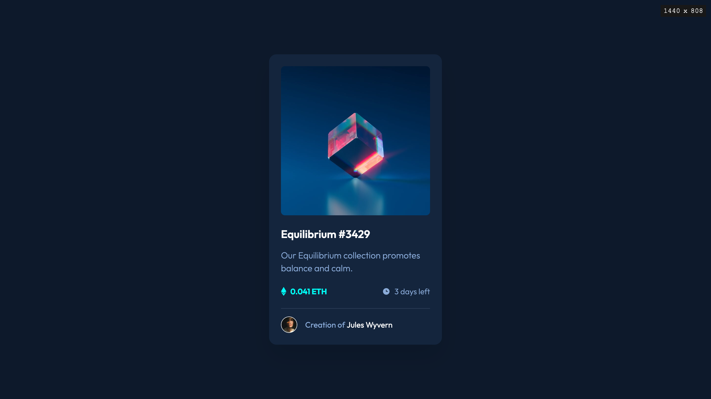

# Frontend Mentor - NFT preview card component solution

This is a solution to the [NFT preview card component challenge on Frontend Mentor](https://www.frontendmentor.io/challenges/nft-preview-card-component-SbdUL_w0U). Frontend Mentor challenges help you improve your coding skills by building realistic projects.

## Overview

### The challenge

Users should be able to:

- View the optimal layout depending on their device's screen size
- See hover states for interactive elements

### Screenshot

### Links

- Solution URL: [https://github.com/darpots/fm-nft-preview](https://github.com/darpots/fm-nft-preview)
- Live Site URL: [https://fm-nft-preview-tau.vercel.app](https://fm-nft-preview-tau.vercel.app)

## Author

- Website - [darpots](https://www.darpots.dev)
- Frontend Mentor - [@darpots](https://www.frontendmentor.io/profile/darpots)
- Twitter - [@darpots](https://www.twitter.com/darpots)
